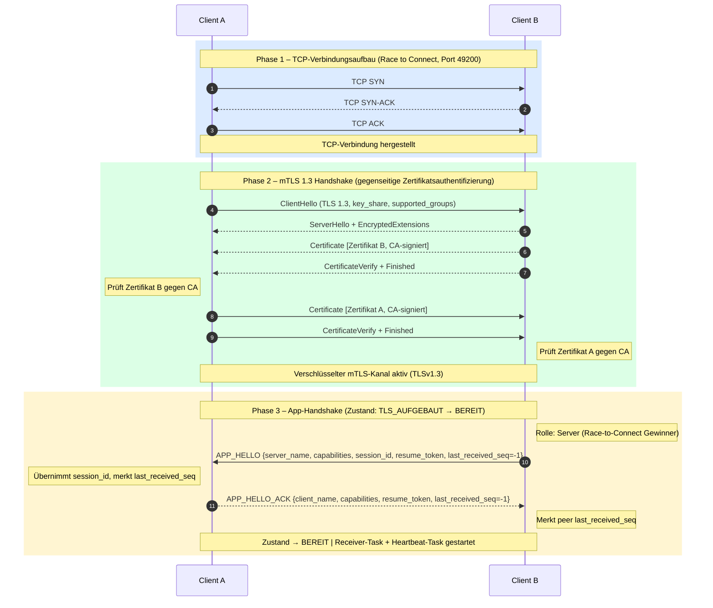
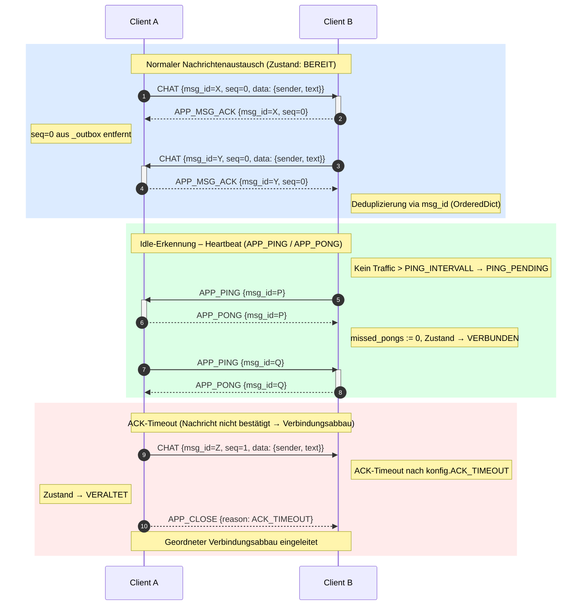
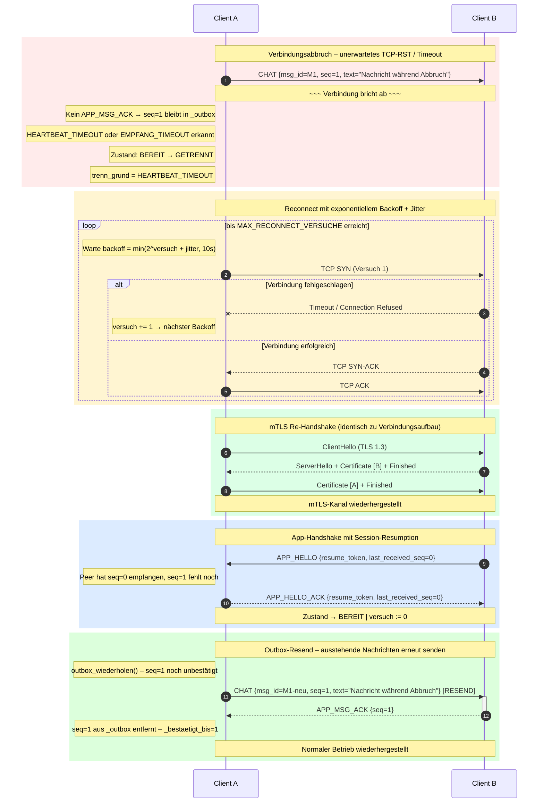

# Sequenzdiagramme – P2P mTLS Chat-Protokoll

> Autor: Gruppe 2 | Modul: Network Security 2026

Die drei Diagramme bilden den vollständigen Protokollablauf ab:
1. **Verbindungsaufbau** – TCP + mTLS 1.3 + App-Handshake
2. **Datenübertragung** – CHAT, ACK, Heartbeat, ACK-Timeout
3. **Verbindungsabbruch, Retry & Resend** – Erkennung, Backoff, Session-Resumption, Outbox

---

## Diagramm 1 – Verbindungsaufbau (TCP → mTLS → App-Handshake)

---

## Diagramm 2 – Datenübertragung (CHAT + ACK + Heartbeat)

---

## Diagramm 3 – Verbindungsabbruch, Retry & Outbox-Resend

---

## Protokoll-Nachrichtentypen (Referenz)

| Typ             | Richtung         | Beschreibung                                      |
|-----------------|------------------|---------------------------------------------------|
| `APP_HELLO`     | Server → Client  | Startet App-Handshake, überträgt `session_id`     |
| `APP_HELLO_ACK` | Client → Server  | Bestätigt Handshake, gibt `last_received_seq` an  |
| `CHAT`          | beide            | Nachricht mit `msg_id`, `seq`, `sender`, `text`   |
| `APP_MSG_ACK`   | beide            | Bestätigt empfangene CHAT-Nachricht (per `seq`)   |
| `APP_PING`      | beide            | Heartbeat-Anfrage bei Idle                        |
| `APP_PONG`      | beide            | Heartbeat-Antwort                                 |
| `APP_CLOSE`     | beide            | Geordneter Verbindungsabbau                       |
| `APP_ERROR`     | beide            | Fehlerrahmen (z. B. bei Protokollverletzung)      |
